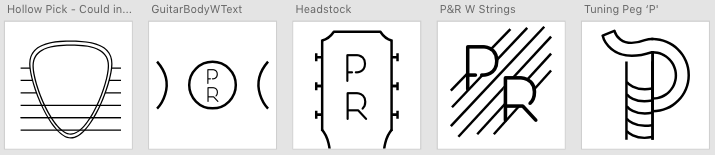

## What am I working on?

This week really is a bunch of random stuff for classes but I'm determined to make time to work on what I want to too (that includes this post!👍). Last week I finished a handful of logos for an app I'm working on for a class. You can check them out below - let me know which one you like best! As always, you can [tweet at](https://twitter.com/_DillonCoffman_) or [email me](mailto:dillcoff@gmail.com). I'll be starting actual development on this app in React Native using [Expo](https://expo.io/) (hopefully) this week, so keep an eye out on [my GitHub](https://github.com/dilloncoffman) for the repo. Feel free to submit a PR if you like the idea and want to get on board! My plan for this week is to get some basic navigation working using [React Navigation](https://reactnavigation.org/). I tried out React Navigation along with animations in React Native not too long ago on [this repo](https://github.com/dilloncoffman/IndieCloud).

## What am I reading?

I've really gotten into *12 Rules for Life: An Antidote to Chaos* by Jordan B. Peterson and am currently on Rule 8. I really dig the long analyses he makes around different topics. Second to Dr. Peterson's book, I continued reading *Think and Grow Rich* by Napoleon Hill which is filled with neat anecdotes and thought-provoking ideas around the power of our thoughts (as cheesy as that might sound, I highly recommend it). Unfortunately I didn't finish *MAKE: Bootstrapper's Handbook* by Pieter Levels just yet, but I'm getting there! I'm working through the chapter on automating the repetitive tasks you might come across in managing a product. Here are two quotes I took away from *12 Rules for Life* and *Think and Grow Rich* this past week respectively:

> "Now, an idea is not the same thing as a fact. A fact is something that is dead, in and of itself. It has no consciousness, no will to power, no motivation, no action. There are billions of dead facts. The internet is a graveyard of dead facts. But an idea that grips a person is alive. It wants to express itself, to live in the world. It is for this reason that the depth psychologists – Freud and Jung paramount among them – insisted that the human psyche was a battleground for ideas. An idea has an aim. It wants something. It posits a value structure."

> From the great storehouse of the ether, the human mind is constantly attracting vibrations that harmonize with that which dominates the mind. Any thought, idea, plan or purpose which one holds in one's mind attracts, from the vibrations of the ether, a host of its relatives. It adds these "relatives" to its own force, and grows until it becomes the dominating motivating master of the individual in whose mind it has been housed."

## Quote I'm digging...
> "Deliberate living: Conscious attention to the basics of life, and a constant attention to your immediate environment and its concerns – A job, a task, a book; anything requiring efficient concentration. Circumstance has no value. It is how one relates to a situation that has value. All true meaning resides in the personal relationship to a phenomenon, what it means to you." ~ Christopher McCandless

## What am I listening to?

["Under Wraps" by Her's](https://www.youtube.com/watch?v=nAyLSDjfJg4)

["A Lotta Things" by Bonny Doon](https://www.youtube.com/watch?v=KuPqrhC9a-U)

["Address Unknown" by The Ink Spots](https://www.youtube.com/watch?v=B00wg2o-SG4)