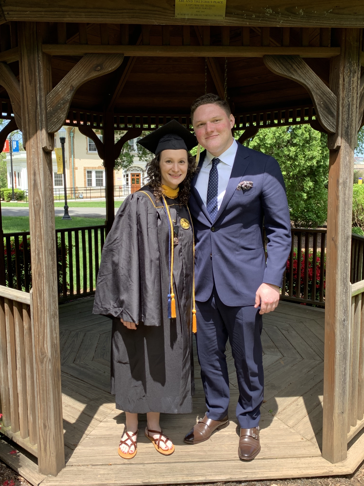

## What am I working on?

This past week has been crazy busy but great! Tuesday I took my last two finals, packed up, and left for home. Wednesday I unpacked and Thursday I was able to work on more Symfony and Node.js for my internship starting next Monday🚀 Friday I left for the weekend, yet again for eastern PA to attend my girlfriend's graduation. Congrats Taylor🎉 Afterward we spent time with her family and went to a local amusement park in the evening. I made it home just in time for Mother's Day and a solid evening with the family. This week I plan to do more development on [PlayRight](https://github.com/dilloncoffman/PlayRight) and finish everything for authentication finally. I spent a little time last week doing so but mostly focused on tech for my internship. I also would like to add new pages to the site here for my reading notes on various books I've finished up. Hoping to get as much done as I can!

## What am I reading?

Given how busy this past week was, I didn't have a whole lot of time to read. I was able to almost finish [_As a Man Thinketh_](http://james-allen.in1woord.nl/?text=as-a-man-thinketh) by James Allen which is a pretty short read. It was the cornerstone from which a lot of similar ideas were built upon in the 20th century. Allen's notions about the power of thought are echoed in books like [_Think and Grow Rich_](http://www.wyzend.com/tagr/tagr01_01.php) by Napoleon Hill, [_How to Stop Worrying and Start Living_](https://www.amazon.com/How-Stop-Worrying-Start-Living/dp/0671733354) by Dale Carnegie, and [_The Strangest Secret_](https://www.amazon.com/Strangest-Secret-Earl-Nightingale/dp/1603865578/ref=sr_1_3?keywords=the+strangest+secret&qid=1557765321&s=gateway&sr=8-3) by Earl Nightingale. Books like these are priceless for building perspective and I highly recommend them. I'm also slowly but surely using the techniques James Clear writes about in [_Atomic Habits_](https://www.amazon.com/Atomic-Habits-Proven-Build-Break/dp/0735211299/ref=sr_1_1?keywords=atomic+habits&qid=1557765336&s=gateway&sr=8-1) to get more done with my time! Stay tuned for a link to my reading notes on it😆

## Quote I'm digging...

> "Everything that’s really worthwhile in life came to us free; our mind, our soul, our body, our hopes, our dreams, our ambitions, our intelligence, our love of family and children and friends. All these priceless possessions are free, but the things that cost us money are actually very cheap and can be replaced at any time." ~ Earl Nightingale, The Strangest Secret

## What am I listening to?

["I Guess I Know You Fairly Well" by Band of Skulls](https://www.youtube.com/watch?v=9_E_R8vOMnA)

["Oh Cecilia" by Born Ruffians](https://www.youtube.com/watch?v=TSSukvA4qC0)

["Time Moves Slow" by BADBADNOTGOOD](https://www.youtube.com/watch?v=r2env-txnms)
