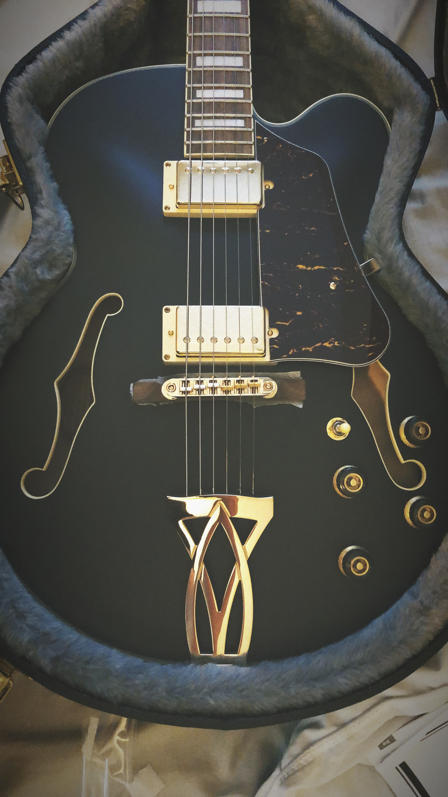

## Hustle...

Between work and being home for the summer with a lot going on, I'm finding it hard to sit down and write these posts and keep my thoughts in order project-wise. Part of me feels like I need to be in a perpetual state of "hustle", that I always need to be learning or doing something to keep busy and build on previous skills. I think it's partially genetic (thanks Dad😬) but it's also a universal feeling. This is especially true today where everywhere you look it seems like you're far behind everyone else. This feeling has come to be known as [impostor syndrome](https://en.wikipedia.org/wiki/Impostor_syndrome) and it can get in the way of a lot of other important things. So what's the answer? How can you and I juggle all of our responsibilities so we don't feel left behind?

## Simplify

A lot of it comes down to what you're exposing yourself to. For example, the tech community has built a huge presence on platforms like Instagram and Twitter. While a lot of the developers I follow encourage finding time to focus on things other than code, it can still feel like you're not doing enough to get ahead. The reality is there will _always_ be new tech to learn and new buzzwords to google, it's just not necessarily your responsibility to keep up with it all. In Napoleon Hill's _Think and Grow Rich_, the third "step to riches" is the principle of autosuggestion. Hill states that:

> "Autosuggestion is the agency of control through which an individual may voluntarily feed the subconscious mind thoughts of a creative nature or, by neglect, permit thoughts of a destructive nature to find their way into this rich garden of the mind."

The important thing to realize is that you have a choice in all of this. No matter what you spend your time doing it will subconsciously have an effect on you, so you may as well prioritize how you're spending that time. [Cal Newport](http://www.calnewport.com/about/) is a big proponent of scrapping social media all together and if you feel like you need to get more done but have no time then you should read [Deep Work](https://www.amazon.com/Deep-Work-Focused-Success-Distracted/dp/1455586692). He also gave an incredible [Ted talk](https://www.ted.com/talks/cal_newport_why_you_should_quit_social_media?language=en) on this same topic. If you find yourself online mindlessly scrolling through your Facebook feed or going down the rabbit hole that is random YouTube video after random YouTube video, then you should read [Digital Minimalism](https://www.amazon.com/Digital-Minimalism-Choosing-Focused-Noisy/dp/0525536515). While I haven't read either of these books in their entirety, I have read bits and pieces of each and watched countless interviews with Cal like [this one](https://www.youtube.com/watch?v=ROKQHRfh2mA). If you still feel overwhelmed and don't have the time to sit and read two books immediately (like most real people😉) just check out this article on [Parkinson's Law](https://www.lifehack.org/articles/featured/how-to-use-parkinsons-law-to-your-advantage.html) and [Warren Buffet's 3-step 5/25 strategy](https://mayooshin.com/buffett-5-25-rule/).

## The Plan

To simplify my time, I narrowed down my own goals:

- Finish my internship strong 💪
  - Currently doing a lot of React work and learning a ton
  - Using ReactN for global state management
  - Jest/Enzyme for testing
  - JSON-Server for faking a REST-API
- Read a book a month 📘
  - Currently reading _Think and Grow Rich_ by Napoleon Hill
- Build a blog with Gatsby and Netlify for Taylor💁‍♂️ 👨‍💻
- Write a blog post at least once every two weeks for the rest of summer 🖋️
- Finish the design of [PlayRight](https://github.com/dilloncoffman/PlayRight) 🎨
  - Start back up development
      - React Native
      - AWS Amplify
      - Lottie Animations
  - Keep a log of _accurate_ tabs of songs I learn along the way

## Update

Last week I slowed down and spent some time with the fam rather than worrying about pushing out a blog post. We headed into the city for breakfast and all the shopping. As an early birthday present my parents picked me up this awesomeness🤤

I can remember walking into Guitar Center when I was younger and my mind melting at how many awesome yet super expensive guitars there were. I've been grateful to have such supportive and cool parents that have enabled me to do what I love throughout my years of playing. Thanks guys!🔥 Check out some "Mad Sounds" by the Arctic Monkeys:

<video width="100%" height="400" controls style="">
<source src="mad_sounds.mov" type="video/mp4">
</video>

## Quote I'm digging...

> “Life is like a play: it's not the length, but the excellence of the acting that matters.”

## Listening To

- ### Music

  ["Tangible Intangible" by Fly Golden Eagle](https://www.youtube.com/watch?v=3aq_CYvN1gE)

  ["Suburban Escape" by Hala](https://youtu.be/76X0G3TdePk?t=380)

  ["Mad Sounds" by Arctic Monkeys](https://www.youtube.com/watch?v=up5DEICL_Q0)

- ### Podcasts

  [Syntax FM](https://overcast.fm/itunes1253186678/syntax-tasty-web-development-treats)

  [The Ground Up Show](https://overcast.fm/itunes1203518464/the-ground-up-show)

  [Philosophize This!](https://overcast.fm/itunes659155419/philosophize-this)
